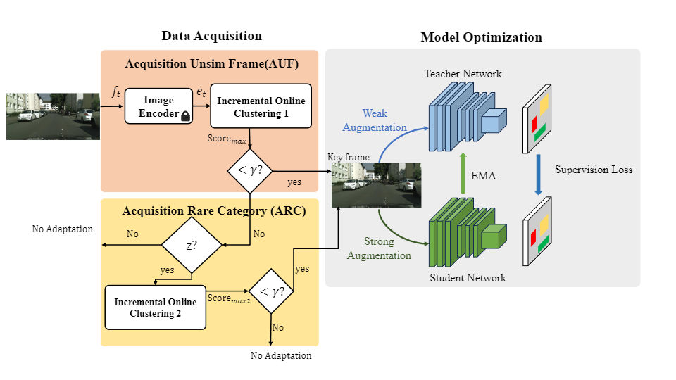

# Improving Online Source-free Domain Adaptation for Object Detection by Unsupervised Data Acquisition

Authors: [Xiangyu Shi](https://www.linkedin.com/in/xiangyushi/), [Yanyuan Qiao](https://yanyuanqiao.github.io/), [Qi Wu](http://www.qi-wu.me/), [Lingqiao Liu](https://lingqiao-adelaide.github.io/lingqiaoliu.github.io//), [Feras Dayoub](https://ferasdayoub.com/)

[[Paper](https://arxiv.org/abs/2310.19258)] [[PDF](https://arxiv.org/pdf/2310.19258)] 

> 

Code comming soon